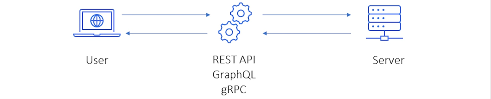
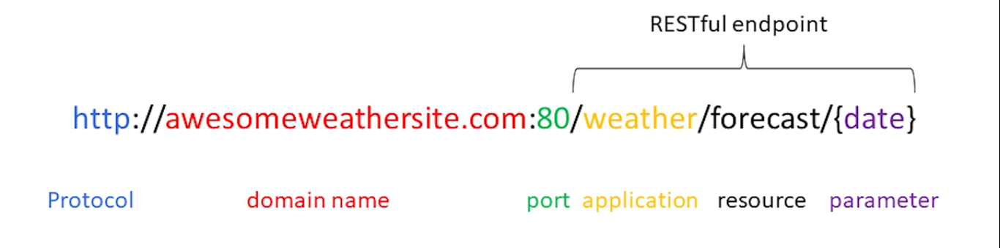
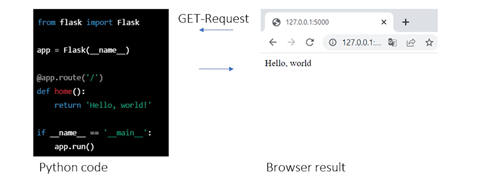

# deploy-pytorch-flask
The essentials of model deployment, on-premise and cloud-based strategies using Flask,  consume data from APIs, and utilize Cloud providers (AWS, GCP, Azure) for deploying model weights and REST APIs.

### Where to deploy?

### How to deploy?

- Common API standard: REST API (REpresentational State Transfer, Application Programming Interface)...
- Webservices communicate with user requests via API
- API defines set of rules for applications to communicate with each other

### URL anatomy

### HTTP methods
- GET:
- POST:
- DELETE:
- PUT:

### Flask
- Web framework for Python
- Lightweight, flexible and easy to user
- Large community, good for documentation

### API testing
- Test APIs Postman
- User friendly UI

